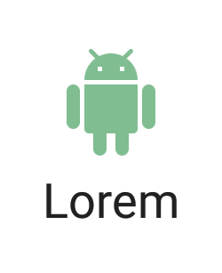
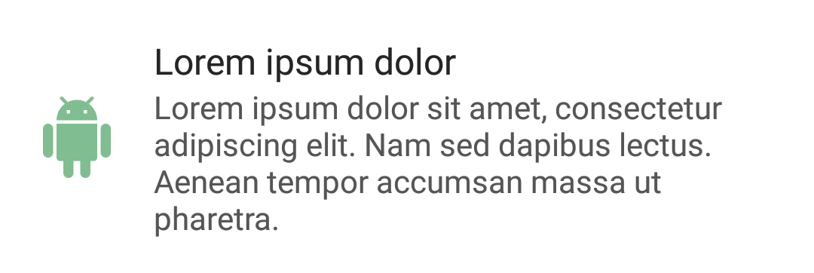

# Android-UI-Basics
Android library which contains basic UI views to help with development. This library contains various common views for usage in Android Apps.
This library also contains a set of colors which are useful in design.

## Installation (Usage)
```gradle

compile 'com.github.bijoysingh:ui-basics:0.4.1'

```

## Colors
Color resources from the following sources
- https://designschool.canva.com/blog/100-color-combinations/
- https://material.google.com/style/color.html/

## Views
Some common views are used in android. This library tries to abstract this logic for you.

### UITextView
`ImageView` on the left of the `TextView`, with a lot more control than using `drawableLeft/Start`.


```xml
<com.github.bijoysingh.uibasics.views.UITextView
   android:layout_width="match_parent"
   android:layout_height="wrap_content"
   android:background="@color/white"
   android:gravity="center_vertical"
   android:padding="16dp"
   ui:iconPadding="@dimen/ui_textview_icon_padding"
   ui:iconSize="48dp"
   ui:iconTextGap="@dimen/ui_textview_icon_text_gap"
   ui:iconTint="@color/dark_hint_text"
   ui:icon="@drawable/ic_android_white_48dp"
   ui:text="@string/big_text_placeholder"
   ui:textColor="@color/dark_tertiary_text"
   ui:textSize="16sp"
   ui:textStyle="@style/CustomUITextView"
   />
```

### UILabelView
`ImageView` on below the `TextView`, lot cleaner than putting LinearLayouts for this.


```xml
<com.github.bijoysingh.uibasics.views.UILabelView
   android:layout_width="wrap_content"
   android:layout_height="wrap_content"
   android:gravity="center"
   android:padding="16dp"
   android:background="@color/white"
   ui:iconPadding="@dimen/ui_labelview_icon_padding"
   ui:iconSize="48dp"
   ui:iconTextGap="@dimen/ui_labelview_icon_text_gap"
   ui:iconTint="@color/canva_1_stem"
   ui:icon="@drawable/ic_android_white_48dp"
   ui:text="@string/tiny_text_placeholder"
   ui:textColor="@color/dark_primary_text"
   ui:textSize="18sp"
   ui:textStyle="@style/CustomUILabelView"
   />
```

### UIContentView
`ImageView` next to a title `TextView` and a subtitle `TextView`.


```xml
<com.github.bijoysingh.uibasics.views.UIContentView
   android:layout_width="wrap_content"
   android:layout_height="wrap_content"
   android:background="@color/white"
   android:gravity="center_vertical"
   android:padding="16dp"
   ui:icon="@drawable/ic_android_white_48dp"
   ui:iconSize="36dp"
   ui:iconTextGap="16dp"
   ui:iconTint="@color/canva_1_stem"
   ui:title="@string/text_placeholder"
   ui:titleSize="16sp"
   ui:titleColor="@color/dark_secondary_text"
   ui:titleStyle="@style/CustomUIContentViewTitle"
   ui:subtitle="@string/big_text_placeholder"
   ui:subtitleSize="14sp"
   ui:subtitleColor="@color/dark_tertiary_text"
   ui:subtitleStyle="@style/CustomUIContentViewSubtitle"
   />
```

### UIActionView
`ImageView` next to a title `TextView` and a subtitle `TextView` and an action Button.


```xml
<com.github.bijoysingh.uibasics.views.UIActionView
   android:layout_width="match_parent"
   android:layout_height="wrap_content"
   android:background="@color/white"
   android:gravity="center_vertical"
   android:padding="16dp"
   ui:icon="@drawable/ic_android_white_48dp"
   ui:iconSize="36dp"
   ui:iconTextGap="16dp"
   ui:iconTint="@color/canva_1_stem"
   ui:title="@string/text_placeholder"
   ui:titleSize="16sp"
   ui:titleColor="@color/dark_secondary_text"
   ui:titleStyle="@style/CustomUIContentViewTitle"
   ui:subtitle="@string/big_text_placeholder"
   ui:subtitleSize="14sp"
   ui:subtitleColor="@color/dark_tertiary_text"
   ui:subtitleStyle="@style/CustomUIContentViewSubtitle"
   ui:action="@drawable/ic_keyboard_arrow_right_white_24dp"
   ui:actionSize="36dp"
   ui:actionTextGap="16dp"
   ui:actionTint="@color/dark_hint_text"
   />
```

If you don't specify an icon, it will automatically be hidden. So you can create a title-subtitle view with a `UIContentView` as well


```xml
<com.github.bijoysingh.uibasics.views.UIContentView
   android:layout_width="match_parent"
   android:layout_height="wrap_content"
   android:background="@color/white"
   android:gravity="center_vertical"
   android:padding="16dp"
   ui:title="@string/text_placeholder"
   ui:titleSize="16sp"
   ui:titleColor="@color/dark_secondary_text"
   ui:titleStyle="@style/CustomUIContentViewTitle"
   ui:subtitle="@string/big_text_placeholder"
   ui:subtitleSize="14sp"
   ui:subtitleColor="@color/dark_tertiary_text"
   ui:subtitleStyle="@style/CustomUIContentViewSubtitle"
   />
```