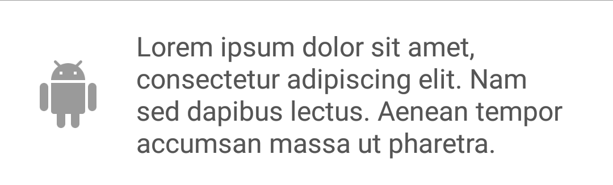

# Android-UI-Basics
Android library which contains basic UI views to help with development. This library contains various common views for usage in Android Apps.
This library also contains a set of colors which are useful in design.

## Colors
Color resources from the following sources
- https://designschool.canva.com/blog/100-color-combinations/
- https://material.google.com/style/color.html/

## Views
### FigTextView
`ImageView` on the left of the `TextView`, with a lot more control than using `drawableLeft/Start`.


```xml
<com.github.bijoysingh.uibasics.views.FigTextView
   android:layout_width="match_parent"
   android:layout_height="wrap_content"
   android:background="#e1e1e1"
   android:gravity="center_vertical"
   android:padding="16dp"
   fig:iconPadding="@dimen/fig_textview_icon_padding"
   fig:iconSize="48dp"
   fig:iconTextGap="@dimen/fig_textview_icon_text_gap"
   fig:iconTint="@color/dark_hint_text"
   fig:icon="@drawable/ic_android_white_48dp"
   fig:text="@string/big_text_placeholder"
   fig:textColor="@color/dark_tertiary_text"
   fig:textSize="16sp"
   fig:textStyle="@style/CustomFigTextView"
   />
```

### FigLabelView
`ImageView` on below the `TextView`, lot cleaner than putting LinearLayouts for this.


```xml
<com.github.bijoysingh.uibasics.views.FigLabelView
   android:layout_width="wrap_content"
   android:layout_height="wrap_content"
   android:background="@color/canva_1_stem"
   android:gravity="center"
   android:padding="16dp"
   fig:iconPadding="@dimen/fig_labelview_icon_padding"
   fig:iconSize="48dp"
   fig:iconTextGap="@dimen/fig_labelview_icon_text_gap"
   fig:iconTint="@color/light_hint_text"
   fig:icon="@drawable/ic_android_white_48dp"
   fig:text="@string/tiny_text_placeholder"
   fig:textColor="@color/light_primary_text"
   fig:textSize="18sp"
   fig:textStyle="@style/CustomFigLabelView"
   />
```

### FigContentView
`ImageView` next to a title `TextView` and a subtitle `TextView`.


```xml
<com.github.bijoysingh.uibasics.views.FigContentView
    android:layout_width="wrap_content"
    android:layout_height="wrap_content"
    android:background="#e1e1e1"
    android:gravity="center_vertical"
    android:padding="16dp"
    fig:icon="@drawable/ic_android_white_48dp"
    fig:iconPadding="@dimen/fig_textview_icon_padding"
    fig:iconSize="36dp"
    fig:iconTextGap="16dp"
    fig:iconTint="@color/canva_1_stem"
    fig:title="@string/text_placeholder"
    fig:titleColor="@color/dark_secondary_text"
    fig:titleSize="16sp"
    fig:titleStyle="@style/CustomFigContentViewTitle"
    fig:subtitle="@string/big_text_placeholder"
    fig:subtitleColor="@color/dark_tertiary_text"
    fig:subtitleSize="14sp"
    fig:subtitleStyle="@style/CustomFigContentViewSubtitle"
    />
```
